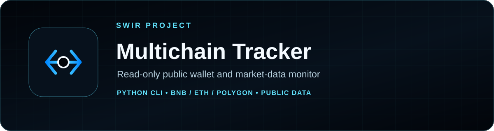
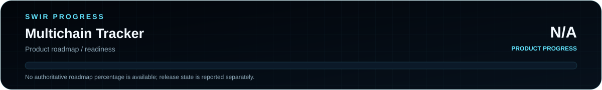

<!-- SWIR-README-STANDARD:v2 -->

<div align="center">



<br>


[**Highlights**](#-highlights) · [**Quick Start**](#-quick-start) · [**Configuration**](#-configuration) · [**Releases**](#-releases)

</div>

# Multichain Tracker

**Read-only public wallet balance, Ethereum transaction and market-price monitor.**



Product progress: **N/A**. The repository has a v1.0.0 release, but it does not maintain an authoritative measurable product-completion roadmap.

## 📍 Project Status

| Item | Status |
|---|---|
| Current stage | Released command-line utility |
| Data mode | Read-only public blockchain and market data |
| Latest public release | [v1.0.0](https://github.com/Swir/Multichain-Tracker/releases/tag/v1.0.0) |
| Product progress | N/A — see [`docs/STATUS.md`](docs/STATUS.md) |
| Repository license | No `LICENSE` file is currently present |

## 🚀 Overview

Multichain Tracker is a Python command-line utility for inspecting a public EVM wallet address. The current source requests native balances on BNB Chain, Ethereum and Polygon, obtains USD market prices from CoinGecko, and retrieves recent transaction data through Etherscan.

The program does not require a wallet private key or seed phrase and does not sign transactions.

## ✨ Highlights

| Feature | What it does |
|---|---|
| 🟡 BNB Chain balance | Reads the native BNB balance from BscScan |
| 🔷 Ethereum balance | Reads the native ETH balance from Etherscan |
| 🟣 Polygon balance | Reads the native Polygon balance from PolygonScan |
| 📜 Ethereum transactions | Retrieves recent incoming/outgoing transaction data through Etherscan |
| 💵 USD prices | Reads ETH, BNB and Polygon market prices from CoinGecko |
| 🎨 Terminal output | Uses Colorama for readable CLI status and transaction output |
| 🔒 Read-only operation | No transaction signing, private key or seed phrase is required |

## ⚙️ Quick Start

### Recommended — Windows release

The v1.0.0 release provides `Multichain-Tracker.exe`, a Windows x64 ZIP and a SHA-256 checksum file.

[**Download v1.0.0 →**](https://github.com/Swir/Multichain-Tracker/releases/tag/v1.0.0)

### From source

```bash
git clone https://github.com/Swir/Multichain-Tracker.git
cd Multichain-Tracker
python -m pip install requests colorama
python main
```

## 🔑 Configuration

Before running the current source, replace the placeholder explorer API keys and wallet address in `main` with your own public-data configuration.

The source uses placeholders corresponding to BscScan, Etherscan and PolygonScan API keys. Do **not** add wallet private keys, seed phrases or signing credentials; they are unnecessary for this read-only tool. Avoid committing personal API keys to a public repository.

## 📋 Requirements / Compatibility

- Python 3.x for source execution.
- `requests` and `colorama`.
- Internet access to the configured explorer endpoints and CoinGecko.
- The release workflow builds the Windows executable with Python 3.11 and PyInstaller.

## 🧠 Technology / Data Flow

| Layer | Technology / role |
|---|---|
| Network requests | Python `requests` |
| Explorer data | BscScan, Etherscan and PolygonScan public account APIs |
| Price data | CoinGecko simple-price endpoint |
| Terminal UI | Colorama |
| Windows packaging | PyInstaller via GitHub Actions |

## ⚠️ Limitations & Financial Disclaimer

- Explorer and market-data APIs can fail, change, throttle or return delayed data.
- The current transaction-history function calls Etherscan, so the displayed recent transaction list is Ethereum-specific; BNB Chain and Polygon transaction history are not implemented by the current source.
- Values are informational only and are not investment, accounting or trading advice.
- No repository `LICENSE` file is currently present, so do not assume an open-source license beyond what is explicitly published.

## 🗺️ Roadmap / Progress

No authoritative measurable product roadmap is currently maintained, so product progress is reported as **N/A** instead of using documentation work or release existence as a fake completion score.

[**Open status →**](docs/STATUS.md)

## 📦 Releases

Latest verified public release: **v1.0.0** with a Windows x64 executable, ZIP archive and SHA-256 checksum.

[**GitHub Releases →**](https://github.com/Swir/Multichain-Tracker/releases)

## 🔎 Search Keywords

`multichain wallet tracker` • `EVM wallet balance checker` • `ethereum wallet tracker python` • `BNB Chain balance checker` • `Polygon wallet balance` • `Etherscan transaction monitor` • `BscScan Python tool` • `PolygonScan wallet checker` • `CoinGecko price monitor` • `read only crypto tracker` • `public wallet monitor` • `Windows crypto CLI`

<div align="center">

### `READ • VERIFY • MONITOR • STAY LOCAL`

⭐ **If this project is useful, consider leaving a star.**

[**← SWIR profile**](https://github.com/Swir) · [**All projects →**](https://github.com/Swir?tab=repositories)

</div>
